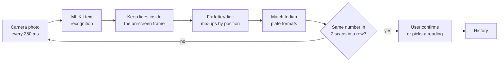

# Bharat ANPR (React Native)

Android app that reads Indian number plates with the phone camera. Text recognition runs on the device, so it works offline and no photos leave the phone.

It reads standard plates (`KA 05 KC 5877`) and Bharat-series plates (`22 BH 1234 AA`). Every reading is confirmed by the user before it is saved.

## Download

Get the latest APK from [Releases](https://github.com/deepakraaaj/Bharat-anpr-ReactNative/releases/latest):

| APK | Use it for |
|---|---|
| `…-arm64-v8a.apk` | Almost every Android phone from the last 6–7 years. Pick this if unsure. |
| `…-armeabi-v7a.apk` | Older 32-bit phones, if the arm64 APK says "App not installed". |

Requires Android 7.0 or later. Opening a downloaded APK can take a while because Google Play Protect scans apps that aren't from the Play Store; the install itself takes seconds.

## How a plate is read



1. **Capture.** [VisionCamera](https://github.com/mrousavy/react-native-vision-camera) takes a photo up to four times a second, reusing one cache file so storage doesn't fill up.
2. **Recognise.** [ML Kit text recognition](https://github.com/a7med-mahmoud/react-native-ml-kit) returns text lines with their positions.
3. **Crop to the frame.** Only lines whose centre falls inside the yellow viewfinder are kept. The frame and this check share the `GUIDE` constant in `src/PlateScanner.tsx`, so they can't drift apart.
4. **Correct.** OCR often swaps look-alike characters (`O`/`0`, `I`/`1`, `S`/`5`, `B`/`8`). Each position is corrected based on what the plate format expects there. `G` in a number position is ambiguous, read as `0` on many plate fonts and `6` on others, so both readings are kept.
5. **Validate.** Candidates must match a standard plate with a real state code, or the BH-series format.
6. **Confirm stability.** A number is only shown once it reads identically in two scans in a row, which filters out one-off misreads of nearby text.
7. **Confirm with the user.** If more than one reading survives, the user picks the right one before it is saved.

There is no plate detector yet: the user aims the phone so the plate sits in the frame. See [Roadmap](#roadmap).

## Project layout

```
App.tsx                 Screens, tab bar, confirmation sheet
src/PlateScanner.tsx    Camera, capture loop, frame cropping, two-scan check
src/plateFormat.ts      Plate formats, OCR correction, display formatting
src/Plate.tsx           Plate rendered as an Indian HSRP plate
src/theme.ts            Colours and type scale
__tests__/              Jest tests (plate parsing and app render)
scripts/make_icons.py   Generates the Android launcher icons
```

There is no hand-written native code. The only Kotlin files are the `MainActivity` and `MainApplication` that React Native generates.

## Development

Requires Node 22.11+, JDK 17 and the Android SDK.

```bash
npm install
npm test
npm run lint
npx tsc --noEmit
```

Run on a phone connected over USB:

```bash
npm start                      # Metro, in one terminal
npm run android                # build, install and launch, in another
```

If the default `java` is newer than 17 or is a JRE without `javac`, the native build fails. Point Gradle at JDK 17:

```bash
export JAVA_HOME=/usr/lib/jvm/java-17-openjdk-amd64
```

## Releasing

1. Bump `versionCode` and `versionName` in `android/app/build.gradle`.
2. Build:

   ```bash
   cd android
   ./gradlew assembleRelease
   ```

   This produces one APK per CPU type in `android/app/build/outputs/apk/release/`. Debug builds stay universal so emulators keep working.
3. Install the arm64 APK on a phone with `adb install -r` and check that it launches before publishing.
4. Publish a GitHub release with both APKs attached.

### Signing

Release builds are signed with the upload key named by these properties in `~/.gradle/gradle.properties`:

```properties
BHARAT_ANPR_UPLOAD_STORE_FILE=/path/to/bharat-anpr-release.jks
BHARAT_ANPR_UPLOAD_KEY_ALIAS=bharat-anpr
BHARAT_ANPR_UPLOAD_STORE_PASSWORD=…
BHARAT_ANPR_UPLOAD_KEY_PASSWORD=…
```

The keystore and passwords are never committed. Without them, release builds fall back to the debug key, and those APKs can't update an installed release. Back up the keystore: if it's lost, users must uninstall before installing a new version.

### App icon

Edit and run `python3 scripts/make_icons.py` (needs Pillow). It writes the adaptive icon layers and the legacy PNGs for every density. The artwork is scaled to 78% because some launchers, such as ColorOS, crop tighter than Android's safe zone.

## Roadmap

- **Saved history.** History currently lasts until the app closes; it should be stored on the device with SQLite.
- **Plate detection.** A detector model (for example a small YOLO model exported to INT8 TFLite) would find plates anywhere in the frame, read several vehicles at once, and ignore nearby text. Check the licence before choosing one: Ultralytics YOLO is AGPL-3.0, which needs a commercial licence for closed-source use, while YOLOX and PP-YOLOE are Apache 2.0.
- **iOS.** The `ios/` project comes from the React Native template and hasn't been built or tested.
